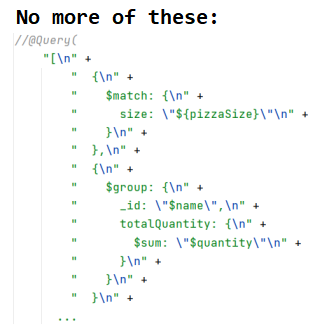
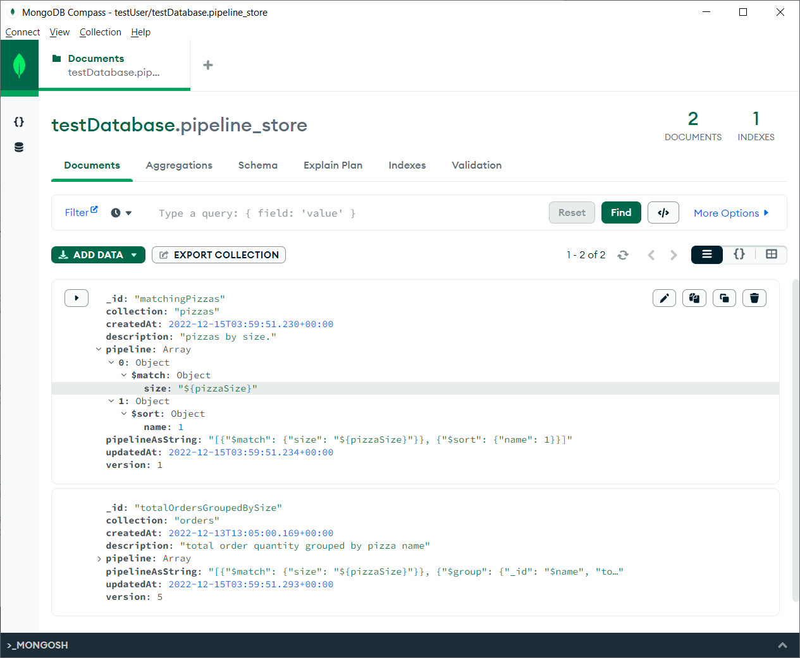

# mongopipe-core

<a href="https://github.com/MongoPipe/">

</a>

[](https://github.com/MongoPipe/mongopipe-core/blob/master/LICENSE)
[](https://opensource.org/)
[-blueviolet)](https://img.shields.io/badge/supported%20JVM-8%2C%209+%20(19)-blueviolet)
[](https://search.maven.org/artifact/org.mongopipe/mongopipe-core/1.0/jar)
[](https://img.shields.io/github/issues/mongopipe/mongopipe-core?color=GREEN)
[](https://img.shields.io/github/last-commit/mongopipe/mongopipe-core)


# Intro
This is for MongoDB aggregation pipeline management. <br>
A MongoDB **aggregation pipeline is a BSON document, so store it in the database like other BSON documents.** <br>
**Hardcoding** is avoided. Code is static. Business rules are dynamic. <br>
Usage examples:
* You are doing fraud detection using pipelines, a DBA might like to tune **urgently** some pipelines rules according to a newly detected fraud risk.
* You have an UI and a client or administrator wants to change **easily** the values displayed by a dynamic combo box(pipeline backed), or to add new chart(pipeline backed) without waiting for a dedicated release with the new functionality.
* You have multiple reports backed by materialized views or pipelines. You want to easily change the reports via API.

MongoDB pipelines can be used for both **querying and updating** the data.<br>
No hardcoding meaning: <br>  <br>

## 3 easy steps.
1. [Configuration](README.md#Configuration)
2. [Create your @Store](README.md#Create-your-store)
3. [Create BSON pipeline](README.md#Create-BSON-pipeline)

### 1. Configuration
Maven dependency
```xml
<dependency>
  <groupId>org.mongopipe</groupId>
  <artifactId>mongopipe-core</artifactId>
  <version>X.Y.Z</version> <!-- Replace X.Y.Z below with the latest release number. -->
</dependency>
```
```java
Stores.registerConfig(MongoPipeConfig.builder()
  .uri("<mongo uri>")
  .databaseName("<database name>")
  //.mongoClient(optionallyForCustomConnection)
  .build());
```
Find more examples in samples [repo](https://github.com/MongoPipe/Examples).

### 2. Create your store
```java
@Store
public interface MyRestaurant {
  @PipelineRun("matchingPizzasBySize") // the db pipeline id, if missing is defaulted to method name. 
  Stream<Pizza> getPizzasBySize(String pizzaSize);      
}    

// Running. 
// A. With Spring framework (needs "mongopipe-spring" dependency):
@Autowired
MyRestaurant myRestaurant;
...
myRestaurant.getPizzasBySize("MEDIUM", ...);

// B. Without Spring:
Stores.from(MyRestaurant.class)
  .getPizzasBySize("MEDIUM");

```
**NOTE**:
1. For **generic running** usages like the ones in the Intro section, meaning no need for pipeline stores(@Store annotated), you can use the
   `Pipelines.getRunner().run` method.  More here: [Generic creation and running](README.md#Dynamic-creation-and-running) <br>
   You only need the pipeline document to exist in the database collection (*pipeline_store*) or to be provided inline.
2. The parameters actual values provided are expected to be in the same order as in the pipeline template. For clearer identification
   annotate using `@Param` the method parameter and provide the template parameter name: <br>
   `List<Pizza> matchingPizzasBySize(@Param("pizzaSize") String pizzaSize)`.
3. As secondary functionality, it supports generation of a CRUD operation just from the method naming similar with Spring Data.
   See [CRUD stores](README.md#CRUD-stores)

### 3. Create BSON pipeline
Create resource file `myFirstPipeline.bson` that will be automatically inserted(via migration process) in the database collection
`pipeline_store`:

```bson
{
 "id": "matchingPizzasBySize",
 "collection": "pizzaCollection",
 "pipeline": [
    {
       $match: { size: "${pizzaSize}" }
    }
  ]
}
```
Store the above <pipeline_name.bson> file in your **source code**, under folder `"src/main/resources/pipelines"` (configurable (step 1) via
`MongoPipeConfig#migrationConfig#pipelinesPath`).<br>
On migration (at process startup time) all the pipelines from that folder will be created/updated in the database collection
`pipeline_store`. <br>
If you are not using Spring and mongopipe-spring dependency you need to manually call the migration on process start like this:
`Pipelines.startMigration()` and all the pipelines will be loaded into the database.
 <br>

NOTE:
1. The pipelines can be also **manually** created using the PipelineStore API(`Pipelines.getStore()`).
2. The file above although static it is input into the migration utility at process startup and thus seeded in the database. It can then be
   updated at runtime via the PipelineStore API or the file can be manually modified and on process startup it will be
   automatically updated in the database by the migration process. More on [Migration)(README.md#Migration).
3. **The parameters form is `"${paramName}"`**. <br>
   Parameters inside the pipeline template **must** be strings (e.g. `"..": "${paramName}"`) in order to be a valid BSON.
   On pipeline run the **actual parameters values can be of any type including complex types: lists, maps, pojos** as long as it can be
   converted to a BSON type.<br>
   For example on pipeline running if the actual parameter value is an integer (e.g. 10) the string value: <br>
   `"x": "${paramName}",` will become an integer value:<br>
   `"x": 10,`
4. The input source from where the pipelines are seeded (via migration) is defaulted to the classpath but can also be an external system. <br>
   Find more examples in samples [repo](https://github.com/MongoPipe/Examples).

# Dynamic creation and running
If you do not want to use an interface to define the pipeline run methods you can instead manually both create and run them:
```java
    // Use PipelineStore for any CRUD operations on pipelines. 
    PipelineStore pipelineStore = Stores.getPipelineStore();

    // 1. From a String:
    String bsonStringPipeline = "{ \"id\": \"myPipeline\", \"collection\": \"pizzaCollection\", \"pipeline\": [ ...";
    Pipeline pipeline = BsonUtil.toPojo(bsonString, Pipeline.class);
    pipelineStore.createPipeline(pipeline);
    
    // 2. Dynamically using BSON API, static imports are from Mongo driver API class: com.mongodb.client.model.Aggregates / Filters.        
    Bson matchStage = match(and(eq("size", "$size"), eq("available", "$available")));
    Bson sortByCountStage = sort(descending("price"));
    pipelineStore.createPipeline(Pipeline.builder()        
        .id("myPipeline")
        .pipeline(asList(matchStage, sortByCountStage))
        //.pipelineAsString("...") can be also provided as a string
        .collection("testCollection")
        .build());
    
    // Run
    PipelineRunner pipelineRunner = Pipelines.getRunner();
    List<Pizza> pizzas = pipelineRunner.run("myPipeline", Pizza.class, Maps.of("size", "medium", "available", true)) // Returns a stream
        .collect(Collectors.toList());
```
NOTE:
1. Store obtained via `Stores.getPipelineStore()` can be used also to create, update and delete pipelines.
2. You can also parameterize an entire pipeline stage/subparts of a stage and send a list/map/pojo/bson as an actual parameter. For example
   When sorting on multiple fields the `{field1: 1, field2: -1}` can be provided as a Java map or pojo class

# Migration
The migration will be started automatically on process start if using Spring framework (mongopipe-spring dependency required) or manually
by invoking:
`Pipelines.startMigration()`. <br>
It will detect all the pipelines that have changed or are new by comparing checksums of the source pipelines with the existing pipelines in
the database. Then it will take appropriate action (create or update) on each pipeline. <br>
The prior value of an updated pipeline will be saved in the `pipeline_store_history` collection for backup purposes. This is configurable.

# CRUD stores
A @Store annotated interface can support both @PipelineRun methods and also CRUD methods by naming convention.<br>
The method signature must match one of the methods from `org.mongopipe.core.store.CrudStore`. E.g.:
```java
@Store(
    items = {
        @Item(type = Pizza.class, collection = "${myConfig.pizzaCollection}")
    }
)
public interface PizzaStore {

  Pizza save(Pizza pizza);
  Pizza findById(String id);
  Iterable<Pizza> findAll();
  Long count();
}
```
NOTE:
1. The store(via the @Store annotation) decides where to put the items and not vice versa meaning an item type class is storage
   agnostic. Thus, the `@Store#items` field acts as a database mapping definition.
2. This feature is secondary, main feature is to manage and run pipelines.

# More examples
Find more examples in samples [repo](https://github.com/MongoPipe/Examples).

# Update operations
Pipelines are mostly used for queries, but they can be used also for updating data:
1. Using [update stages](https://www.mongodb.com/docs/manual/tutorial/update-documents-with-aggregation-pipeline/) like for example the `$replaceRoot`.
2. Using dedicated commands like for example [findOneAndUpdate](findOneAndUpdate()) which can be run by setting `Pipeline#commandOptions`.
   The findOneAndUpdate allows also to insert the document if it does not exist.

Without pipelines, you can use [CRUD stores](README.md#CRUD-stores)

# Support and get in touch

If you have a bug or an idea, browse the open issues and create a new one. <br>

 We like direct discussions. Check email address on the github profile of the committers.


